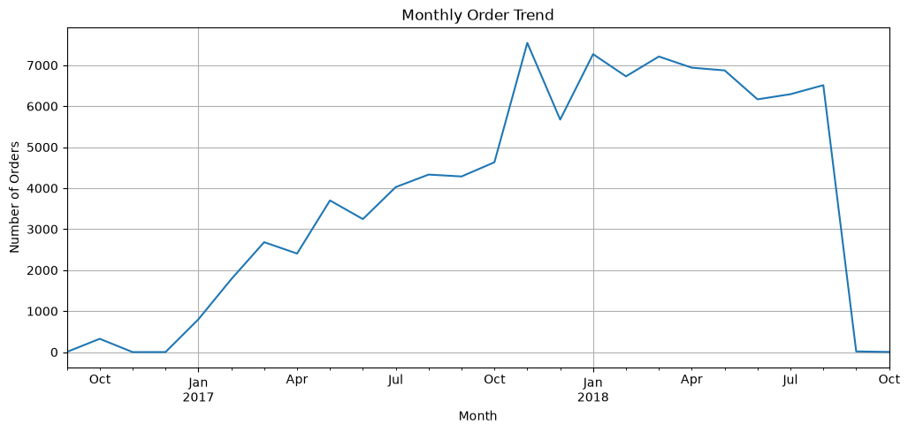
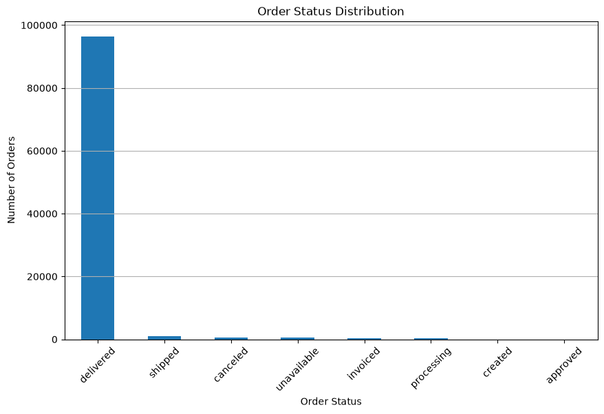
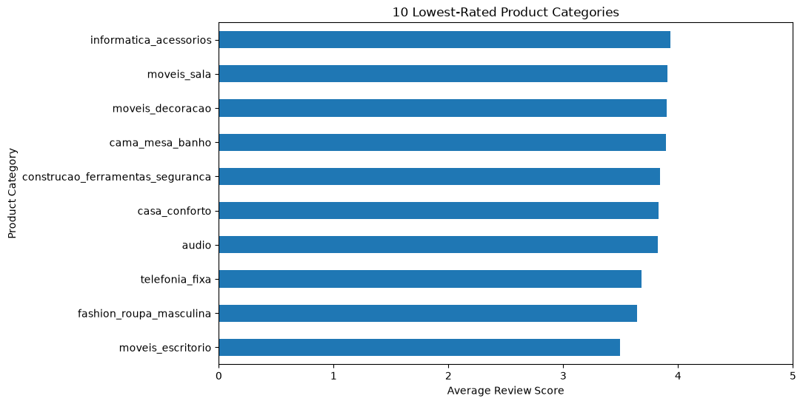
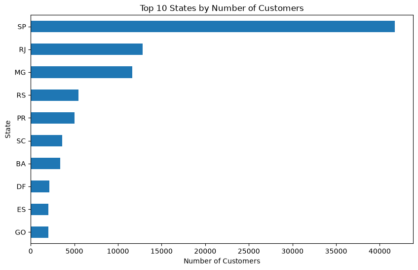
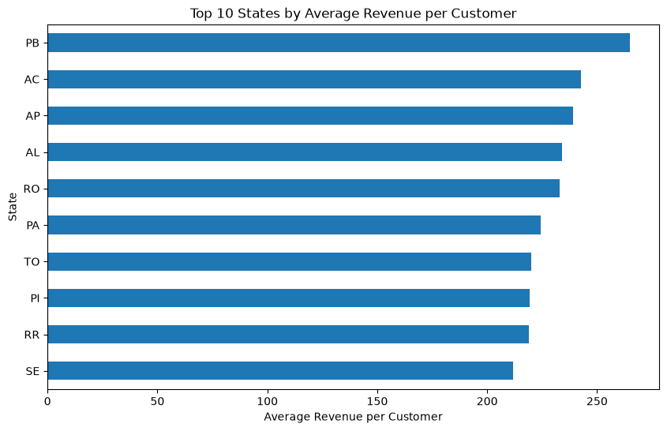
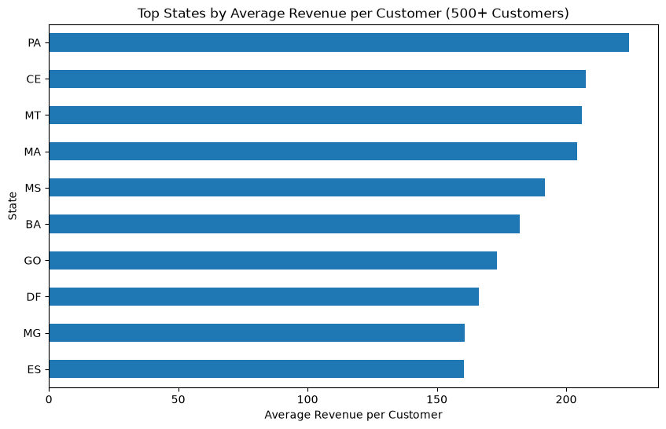
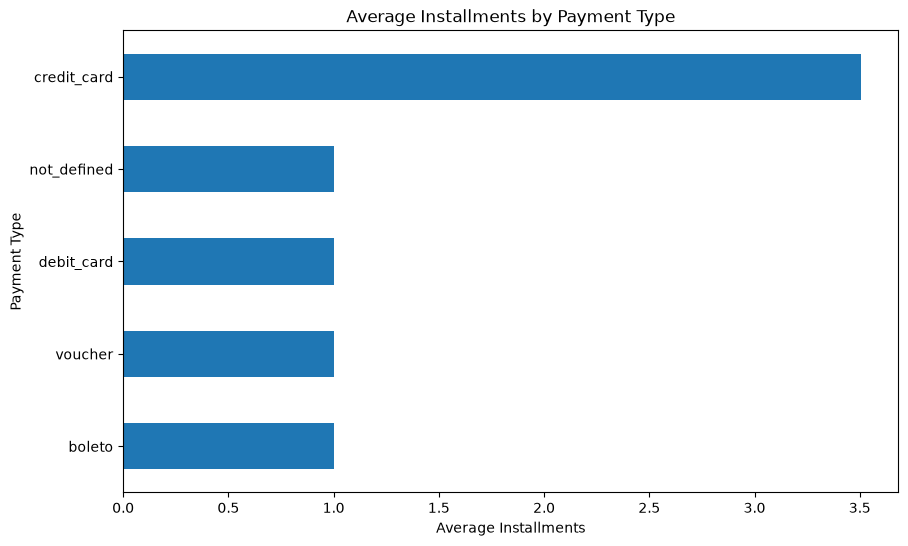
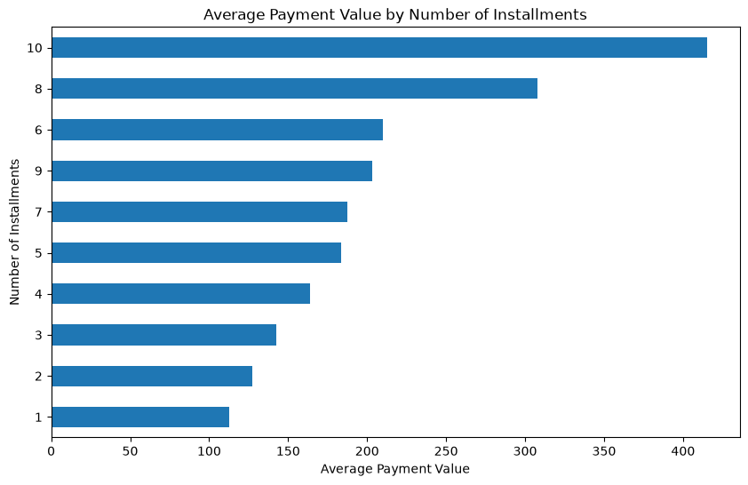
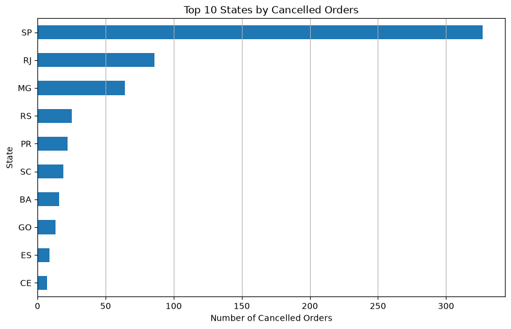

# 🇧🇷 Brazilian E-Commerce Data Analysis

[](https://www.python.org/)
[](https://pandas.pydata.org/)
[](https://numpy.org/)
[](https://matplotlib.org/)
[](https://jupyter.org/)
[](LICENSE)

> **Exploratory Data Analysis of Brazilian e-commerce performance, customer behavior, payments, delivery, and satisfaction.**

---

## 📑 Table of Contents

- [Project Overview](#-project-overview)
- [Dataset](#-dataset)
- [How to Run](#-how-to-run)
- [Business Questions](#-business-questions)
- [Dataset at a Glance](#-dataset-at-a-glance)
- [Key Insights](#-key-insights)
- [Visualizations](#-visualizations)
- [Tools & Technologies](#-tools--technologies)
- [Project Structure](#-project-structure)
- [Business Takeaways](#-business-takeaways)
- [What I Learned](#-what-i-learned)
- [Conclusion](#-conclusion)
- [Author](#-author)

---

## 📌 Project Overview

This project explores the **Brazilian Olist e-commerce dataset** to uncover patterns in sales, customers, products, payments, delivery performance, customer satisfaction, and order cancellations.

The analysis focuses on turning raw transactional data into **business-relevant insights** that can help understand:

- 📈 Sales and revenue performance
- 🌎 Customer distribution across Brazil
- 🛍️ Product category performance
- 💳 Payment methods and installment behavior
- 🚚 Delivery efficiency
- ⭐ Customer satisfaction
- ❌ Order cancellations

---

## 🗂 Dataset

This project uses the **[Brazilian E-Commerce Public Dataset by Olist](https://www.kaggle.com/datasets/olistbr/brazilian-ecommerce)**, available on Kaggle. It contains information on ~100,000 orders placed between 2016 and 2018 across multiple marketplaces in Brazil, covering order status, pricing, payments, freight performance, customer location, product attributes, and customer reviews.

> The raw CSV files are not committed to this repository. Download them from the Kaggle link above and place them in the `Data/` folder before running the notebook.

---

## ▶️ How to Run

1. Clone the repository:
   ```bash
   git clone https://github.com/snehaldevadkar/Brazilian-eCommerce-Data-Analysis.git
   cd Brazilian-eCommerce-Data-Analysis
   ```
2. Install the dependencies:
   ```bash
   pip install -r requirements.txt
   ```
3. Download the [Olist dataset](https://www.kaggle.com/datasets/olistbr/brazilian-ecommerce) from Kaggle and place the CSV files in the `Data/` folder.
4. Launch Jupyter and run the notebook end to end:
   ```bash
   jupyter notebook Olist_EDA.ipynb
   ```

---

## 🎯 Business Questions

The analysis was designed around the following questions:

1. How do orders and revenue change over time?
2. Which Brazilian states generate the most revenue?
3. Which product categories contribute the most revenue?
4. What payment methods do customers prefer?
5. How does installment behavior vary by payment type?
6. Does delivery time affect customer satisfaction?
7. Which states have the highest number of cancelled orders?

---

## 📊 Dataset at a Glance

| Metric                           | Result                     |
| --------------------------------- | -------------------------- |
| 🛒 Total Orders                   | **99,441**                 |
| ❌ Cancellation Rate              | **~0.63%**                 |
| 🏆 Top Revenue State              | **São Paulo (SP)**         |
| 🥇 Top Revenue Category           | **Beauty & Personal Care** |
| 💳 Dominant Payment Method        | **Credit Card**            |
| 🚚 Delivery vs Review Correlation | **~ -0.33**                |

---

## 🔎 Key Insights

### 🛒 Sales Performance

- The dataset contains **99,441 orders**.
- Monthly orders and revenue generally increased throughout the observed period.
- Strong performance was observed around **late 2017 and early 2018**.

### 🌎 Geographic Performance

- **São Paulo (SP)** has the largest customer base and generates the highest total revenue.
- Other major markets include **Rio de Janeiro (RJ)** and **Minas Gerais (MG)**.
- Revenue is strongly concentrated in states with larger customer populations.

### 🛍️ Product Performance

- **Beauty & Personal Care (`beleza_saude`)** is the highest-revenue product category among the analyzed categories.
- Product-category analysis helps identify which segments contribute most to overall revenue.

### 💳 Payment Behavior

- **Credit cards** are the dominant payment method.
- Single-payment transactions represent a significant share of purchases.
- Credit-card users account for most installment activity.

### 🚚 Delivery & Customer Satisfaction

One of the strongest findings from the analysis is the relationship between delivery time and customer satisfaction.

**Delivery time and review score show a negative correlation of approximately -0.33.**

| Review Score | Average Delivery Time |
| ------------ | ---------------------- |
| ⭐ 5         | **~10.2 days**          |
| ⭐ 1         | **~20.8 days**          |

This suggests that **longer delivery times are associated with lower customer review scores**.

> ⚠️ **Important:** Correlation does not prove that delivery time alone causes lower ratings. Other factors may also influence customer satisfaction.

### ❌ Order Cancellations

- The overall cancellation rate is approximately **0.63%**.
- Cancelled orders are concentrated in larger customer markets.
- **SP, RJ, and MG** account for a significant share of cancelled orders.

---

## 📈 Visualizations

### Monthly Order Trend


### Monthly Revenue Trend


### Order Status Distribution


### Top 10 Product Categories by Revenue


### Lowest Rated Product Categories


### Top 10 States by Revenue


### Top 10 States by Customers


### Top States by Average Revenue


### Top States by Average Revenue (500+ Customers)


### Revenue by Payment Type


### Average Installments by Payment Type


### Average Payment Value by Installments


### Average Delivery Time by Review Score


### Cancelled Orders by State


---

## 🧰 Tools & Technologies

| Tool                   | Purpose                      |
| ----------------------- | ----------------------------- |
| 🐍 **Python**           | Data analysis                |
| 🐼 **Pandas**           | Data manipulation & analysis |
| 🔢 **NumPy**            | Numerical operations         |
| 📊 **Matplotlib**       | Data visualization           |
| 📓 **Jupyter Notebook** | Analysis environment         |

---

## 📂 Project Structure

```
Brazilian-eCommerce-Data-Analysis/
│
├── Data/
│   └── Dataset files (download from Kaggle, see Dataset section)
│
├── output/
│   ├── monthly_order_trend.png
│   ├── monthly_revenue_trend.png
│   ├── order_status_distribution.png
│   ├── top_10_product_categories_revenue.png
│   ├── lowest_rated_product_categories.png
│   ├── top_10_states_revenue.png
│   ├── top_10_states_customers.png
│   ├── top_states_avg_revenue.png
│   ├── top_states_avg_revenue_500_customers.png
│   ├── revenue_by_payment_type.png
│   ├── average_installments_payment_type.png
│   ├── average_payment_value_installments.png
│   ├── average_delivery_time_review_score.png
│   └── cancelled_orders_by_state.png
│
├── Olist_EDA.ipynb
├── requirements.txt
├── .gitignore
├── LICENSE
└── README.md
```

---

## 💡 Business Takeaways

### 1. 🚚 Improve Delivery Performance
The negative relationship between delivery time and review scores suggests that improving delivery efficiency could potentially improve customer satisfaction.

### 2. 🌎 Focus on High-Value Markets
São Paulo and other major states represent important revenue markets and deserve continued attention from sales and logistics teams.

### 3. 💳 Optimize Payment Experience
Credit cards dominate customer payments, making the payment experience and installment options important areas for optimization.

### 4. 🛍️ Monitor High-Revenue Categories
High-performing categories such as Beauty & Personal Care can be analyzed further for pricing, inventory, marketing, and customer retention opportunities.

### 5. ❌ Monitor Cancellation Patterns
Although the cancellation rate is relatively low, geographic concentration can help identify markets where operational issues may require additional investigation.

---

## 🧠 What I Learned

Through this project, I practiced:

- Data cleaning and preprocessing
- Exploratory data analysis
- Aggregation and grouping with Pandas
- Time-series analysis
- Geographic analysis
- Payment behavior analysis
- Correlation analysis
- Data visualization
- Extracting business insights from raw data
- Communicating analytical findings through a GitHub project

---

## 🏁 Conclusion

This project demonstrates how exploratory data analysis can be used to understand **e-commerce performance beyond basic sales numbers**.

The analysis identified important patterns across revenue, geography, product categories, payment behavior, delivery performance, customer satisfaction, and cancellations.

The most notable finding is the relationship between **delivery time and customer review scores**, where longer delivery times are associated with lower ratings.

Overall, the project shows how data can be transformed into **clear business insights that support better decisions around sales, logistics, customer experience, and market performance.**

---

## 👤 Author

### **Snehal Devadkar**

**Aspiring Data Analyst | Python | SQL | Power BI | Excel**

📌 This project is part of my **Data Analytics portfolio** and demonstrates my ability to analyze real-world datasets and communicate business insights through data.

<!-- Add your links below -->
🔗 [LinkedIn](#) · [Portfolio](#) · [Email](#)

---

⭐ **If you found this project useful, feel free to explore the notebook and visualizations.**
